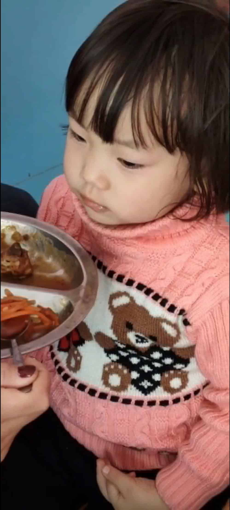

# 今天开始上幼儿园了

*2022-02-22*

昨天大山（我媳妇）带着小朵去看了楼下的幼儿园，在自己家楼下接送孩子方面，不管多少钱了，就先选这了。

所以今早我七点五十就给大山 Facetime，因为幼儿园八点到八点十分上学。看样子小朵十分纠结，前几天被我和大山忽悠的说想上幼儿园，今天可能觉察到事情可能不像她想的那样，反正有点纠结一会儿说：“妈妈我不要去幼儿园”，一会儿又在大山：“去滑滑梯啊！和小朋友一起玩儿呀”的诱惑中又有点向往。

等我九点十分到了公司又给大山视频，大山已经到家了。我问小朵哭了没？不问还好，这一问，大山绷不住了，眼泪唰唰的掉下来了。母女连心呢！

中午老师发了个小朵吃饭的视频，看样子还不错，吃的挺欢实的。大山中午给小朵送被子，老师说吃完饭后在怀里睡着了。

看小家伙下午放学后的表现吧，明天打赌看她哭不哭！

下午大山接回了小朵，视频一看眼睛都肿了，问她：“闺女怎么哭了呀？”，小朵想了一会儿才回答：“我也不知道啊！”

大山说接小朵回家的时候，她没哭。有个小朋友从早上去幼儿园到放学都一直在哭，可怜的娃！
